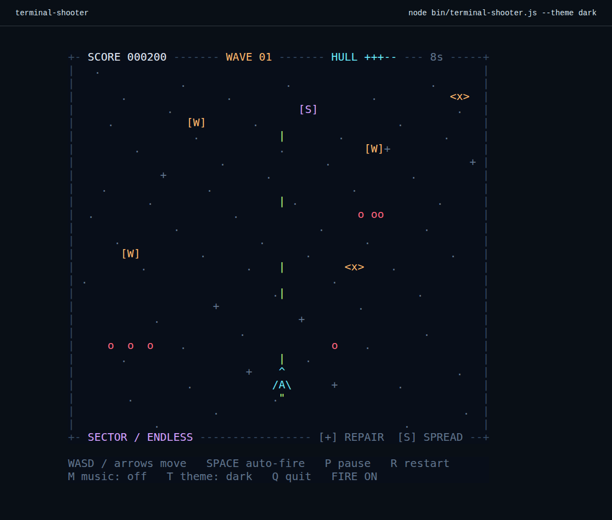
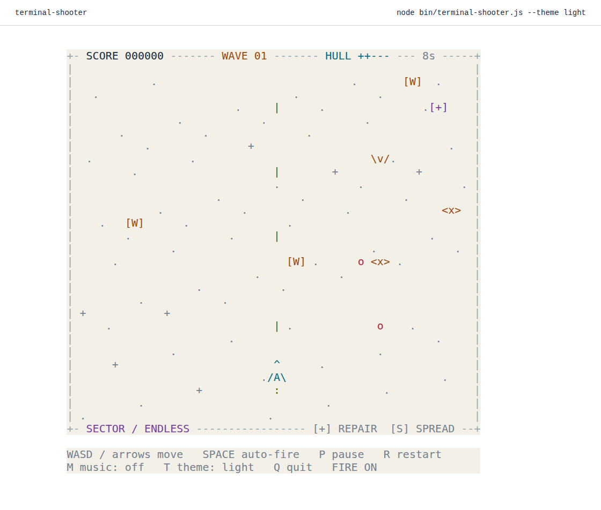

<div align="center">

# terminal-shooter

**Small ships. Endless space. One more run.**

A vertical arcade shooter for your Linux or macOS terminal.<br>
ASCII ships, progressively harder waves, and an original 8-bit soundtrack.<br>
The browser edition uses the very same game engine.

[Quick start](#quick-start) · [Controls](#controls) · [Play in a browser](#play-in-a-browser)

</div>



<details>
<summary><strong>Prefer a white terminal? See the light theme.</strong></summary>



</details>

## Quick start

Requires **Node.js 20+** and an ANSI-compatible terminal on **Linux or macOS**.
No npm packages to install.

```sh
git clone https://github.com/digital-coworker/terminal-shooter.git
cd terminal-shooter
npm start
```

For a white terminal:

```sh
npm start -- --theme light
```

Want a command available everywhere? From the cloned directory, run `npm link`,
then `terminal-shooter`.

## Fly. Dodge. Survive.

- Three enemy types: scouts, weaving ships, and armored tanks.
- Waves grow faster and denser as you survive. Enemy fire keeps you moving.
- Three lives, brief invulnerability after a hit, and collectible power-ups.
- Automatic fire, particle explosions, and a scrolling starfield.
- Dark and light palettes, with the same character-cell art in both editions.
- Pause, restart, and an optional original synthesized soundtrack.

## Controls

| Key | Action |
| :-- | :-- |
| **W A S D** / **↑ ← ↓ →** | Move |
| **Space** | Toggle automatic fire (on by default) |
| **P** | Pause / resume |
| **R** | Restart |
| **M** | Toggle music |
| **T** | Switch dark / light theme |
| **Q** / **Ctrl+C** | Quit the terminal game |

The terminal reports when it needs more room; resize the window to continue.
Terminal key repeat is controlled by your OS. The browser supports held keys
and touch controls.

## Turn it up

Music is **off by default**. Press **M** to enable the original looping chiptune.
It is generated locally—no downloads, licensed samples, or streaming services.

- **macOS:** uses the built-in `afplay`.
- **Linux:** install FFmpeg for `ffplay` (for example, `sudo apt install ffmpeg`).
- **Browser:** uses Web Audio after you interact with the page.

No audio player or sound device? The game still plays silently.

## Play in a browser

The complete browser edition is included—no build step, account, backend, or
external assets required:

```sh
python3 -m http.server 8080
```

Open **http://localhost:8080** and launch the game. It includes touch controls,
a saved local best score, and automatic pause when the tab loses focus.

**GitHub Pages:** the publishing token cannot enable Pages. To make the included
browser game public, open [Settings → Pages](https://github.com/digital-coworker/terminal-shooter/settings/pages),
choose **Deploy from a branch → main → / (root)**, and save. The game will then
be available at **https://digital-coworker.github.io/terminal-shooter/**.

## Under the hood

Plain JavaScript. Zero runtime dependencies. One deterministic simulation and
one ASCII framebuffer shared by the terminal and browser. The CLI uses Node's
built-in raw TTY APIs; the web edition is a static site.

```sh
npm test                              # simulation, audio, renderer, and UI tests
python3 scripts/smoke-terminal.py      # actual PTY input, resize, and cleanup
```

The screenshots above capture **actual CLI output from a real pseudo-terminal**
rendered in xterm.js, not mock game screens. See [CONTRIBUTING.md](CONTRIBUTING.md)
for reproducible screenshot capture, architecture, and the optional Linux/macOS
CI configuration.

**Verification:** automated tests, Linux PTY gameplay/lifecycle checks, and browser
interaction checks. macOS is supported by the implementation but has not been
runtime-tested here; physical audio output cannot be verified on a headless host.

---

[MIT](LICENSE) · Built for a little break between commands.
